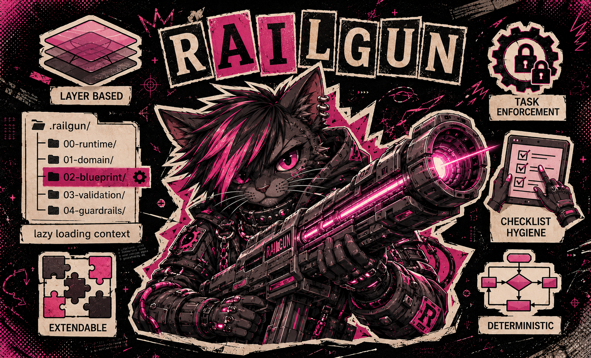

<p align="center">
  
</p>

<h1 align="center">⚡️ RAILGUN</h1>

<p align="center"><strong>R</strong>epository-level <strong>A</strong>I <strong>L</strong>ogic & <strong>G</strong>uidance <strong>U</strong>nified <strong>N</strong>etwork</p>

<p align="center">
  <a href="#-system-architecture">System Architecture</a> •
  <a href="#-layers-how-the-railgun-stack-works">Layers</a> •
  <a href="#-adding-new-rules-to-railgun">Adding Rules</a> •
  <a href="#-task-enforcement--lifecycle-lock">Lifecycle Lock</a> •
  <a href="#-extending-the-rails">Extending</a>
</p>

**RAILGUN** is an **enterprise-ready, highly customizable methodology** embedded directly into your repository. It forces AI agents (Kimi Code CLI, Claude Code, Cursor, Windsurf, Copilot, Codex) to write deterministic, compliant, and architecture-aligned code.

Built for scale, RAILGUN adapts to your specific product and engineering team. It replaces chaotic AI guesswork with a strict, modular system of markdown "rails" that act as the immutable source of truth for any autonomous agent touching your codebase.

* **What it is:** A zero-dependency routing system for AI context, injected into your file tree via `AGENTS.md` anchors.
* **Why you need it:** AI agents operate on probability. Left unchecked, they introduce silent architectural drift, invent their own design patterns, and rack up massive API bills.
* **The payoff:** More predictable AI behavior, drastically lower token spend, and seamless onboarding for multi-agent development teams.

---

## 🥊 🤖 Big `AGENTS.md` vs. ⚡️ RAILGUN

Many teams try to control their AI by dumping every project rule, methodology preference, and business term into a massive, monolithic `.cursorrules` or `agents.md` file. This is a critical mistake.

| 🤖 The Monolithic `AGENTS.md` | ⚡️ The RAILGUN methodology |
| --- | --- |
| **Token Nightmare:** Injects 5,000+ lines of text into the context window for *every single prompt*, even for a 1-line typo fix. | **Context Lazy-Loading:** `AGENTS.md` files act as lightweight dispatchers. Only the specific rules required for the current task are loaded, slashing token costs. |
| **Context Degradation:** The AI gets "distracted" by backend rules when writing frontend code, leading to hallucinations. | **Laser Focus:** The AI reads `01-domain/AGENTS.md` when doing database work, and `02-blueprint/AGENTS.md` when doing architecture. Zero noise. |
| **Maintenance Hell:** A single 10-page markdown file becomes impossible for human developers to maintain and update. | **Modular & Clean:** Rules are neatly organized into folders (`01-domain`, `02-blueprint`). Updates are frictionless. |
| **Unreliable Discovery:** The agent must "decide" to read the file. If it forgets, the rules are ignored. | **Automatic Activation:** `AGENTS.md` is discovered and loaded by the agent automatically when working with files in the directory tree. The agent cannot skip it. |

---

## 💸 How RAILGUN Saves Tokens (Context Lazy-Loading)

LLMs charge by the token. When you use a massive global prompt, the AI reads your testing standards, your commit rules, and your API guidelines on *every single request*.

RAILGUN introduces **Context Lazy-Loading** via hierarchical `AGENTS.md` files:

1. The root `AGENTS.md` activates RAILGUN and points to `.railgun/AGENTS.md` (the Command Center).
2. The Command Center contains almost no actual rules—only navigation maps.
3. The agent then loads the specific `AGENTS.md` in the relevant layer (e.g., `02-blueprint/`).
4. That layer's `AGENTS.md` dispatches to the exact rail file needed (e.g., `state-management.md`).

If you ask the agent to *"fix the padding on the submit button,"* it won't read your database schemas or your unit testing protocols. It saves your context window for what actually matters: the code.

---

## ⚠️ Reality Check: LLMs Are Probabilistic

RAILGUN is a **scaffolding system**, not magic. It drastically improves consistency and reduces token waste, but it cannot turn a probabilistic LLM into a deterministic compiler.

Here is what actually happens in the real world:

* **Agents sometimes skip steps.** Even with mandatory `AGENTS.md` discovery, an agent can occasionally forget to check `00-runtime/current.md` or skip the Final Gate checklist. A simple reminder like *"Follow RAILGUN and cite the rails you used"* usually fixes it.
* **Rules can be misinterpreted.** An agent might read `state-management.md` and still mutate state directly in a component because the pattern looked "close enough" to its training data. This is normal LLM behavior — not a failure of RAILGUN.
* **Context windows have limits.** On very large tasks, the agent may lose track of earlier rails. Breaking work into smaller tasks helps more than adding more rules.

**The bottom line:** RAILGUN moves you from *"random agent behavior"* to *"mostly predictable agent behavior with clear recovery paths."* When an agent drifts, you don't rewrite your whole system — you just point it back to the relevant rail.

---

## 🛠️ See It In Action: Building a React Component

Let's trace how a RAILGUN-equipped agent handles a standard task: *"Build a new `<CartWidget/>` React component."*

1. **Automatic Activation:** The AI opens the project and automatically loads the root `AGENTS.md`. It learns that this repository is RAILGUN-controlled and must read `.railgun/AGENTS.md` before any action.
2. **Command Center:** It opens `.railgun/AGENTS.md` and learns the mandatory execution loop: always check runtime first, then load only the relevant layers.
3. **Sprint Check:** It loads `00-runtime/AGENTS.md` and notes that the team is currently refactoring the legacy UI, so it should be extra careful with global styles.
4. **Domain Sync:** Before naming variables, it loads `01-domain/AGENTS.md`. The dispatcher points to `glossary.md`. It learns that items in a cart are strictly called `CartLineItem` (never `ProductItem` or `CartRow`).
5. **Layer Dispatch:** It classifies the task as "frontend / state-related" and loads `02-blueprint/AGENTS.md`. The layer's dispatcher tells it to read `state-management.md`.
6. **Architectural Blueprint:** It follows the link to `02-blueprint/state-management.md` and learns that it must read state using a specific `Zustand` store hook, and that mutating the cart directly inside the React component is forbidden.
7. **Validation Check:** It writes the React code, then loads `03-validation/AGENTS.md`. The dispatcher points to `unit-tests.md`. It learns it must use React Testing Library, select elements via `data-testid`, and mock the network. It writes the test.
8. **The Sign-off:** Finally, it loads `04-guardrails/AGENTS.md`, runs through the `checklist.md`, ensures no `console.log` statements are left, and commits the work using the exact Conventional Commit format required, citing the rails it used in the footer.

**Result:** A perfect, enterprise-grade React component, written exactly how your senior engineers would write it.

---

## 🔒 Task Enforcement & Lifecycle Lock

RAILGUN does not merely suggest rules—it enforces them through a rigid, three-phase task lifecycle embedded in the Command Center (`AGENTS.md`).

### Phase 1: Discovery
Before any code is written, the agent MUST:
1. Read `00-runtime` to learn current sprint constraints
2. Use the Task-to-Layer Matrix to identify which layers apply
3. Read each relevant layer's `AGENTS.md` dispatcher
4. Load the specific rails referenced by the dispatchers
5. Explicitly confirm which rails are loaded and will be followed

The agent cannot skip Discovery. The root `AGENTS.md` is loaded automatically by the tool, making this phase infrastructure-level, not optional.

### Phase 2: Execution
The agent writes code in strict compliance with the loaded rails only. No improvisation. If a pattern is not covered by a loaded rail, the agent asks the human for clarification rather than inventing a solution.

### Phase 3: Final Gate (Non-Negotiable)
Before the agent is permitted to say "done", "finished", or "complete", it MUST:
1. Load `04-guardrails/AGENTS.md`
2. Read `04-guardrails/checklist.md`
3. Explicitly confirm each applicable checklist item
4. Fix any failures immediately

The `04-guardrails` layer contains the **Non-Negotiable Completion Rule**: there are no exceptions, no "I will fix it later", and no bypassing the checklist. This ensures that every task—whether a 1-line fix or a new feature—passes the same quality gate.

### Checklist Hygiene
After confirming the checklist and declaring the task complete, the agent resets all checkboxes back to `[ ]` (unchecked). The next agent must start with a clean checklist. This is enforced by the `Agent Hygiene Rule` inside `checklist.md`.

### Adding New Rails Safely
When the team needs a new rule, it is added via the **Rail Protocol** (`.railgun/rail-protocol.md`). The agent validates layer placement, checks for duplicates against existing rails, ensures format compliance, updates the layer dispatcher, and verifies no contradictions exist across layers. Humans should not hand-craft rails without running them through this protocol.

---

## 🏗️ Adding New Rules to RAILGUN

**Never edit rails manually.** RAILGUN is a deterministic system: every change must pass validation to prevent contradictions, duplicates, and broken cross-references.

Instead, ask your AI agent to do it. The agent automatically follows `.railgun/rail-protocol.md`, which enforces:

1. **Layer placement check** — is this domain, blueprint, validation, or guardrails?
2. **Duplicate detection** — does a similar rail already exist?
3. **Format compliance** — imperative language, no essays, no code snippets.
4. **Dispatcher update** — the layer's `AGENTS.md` must point to the new rail.
5. **Contradiction scan** — the new rule must not conflict with existing layers.

### Example Prompts

Here is exactly what to tell your AI agent:

**Adding a new architectural rule:**
> "Add a new rail to RAILGUN that forbids direct `axios` calls in React components. All HTTP requests must go through the API client in `lib/api-client.ts`. Place it in the blueprint layer."

**Updating an existing rail:**
> "Update the `02-blueprint/state-management.md` rail: we are migrating from Zustand to Redux Toolkit. Replace all Zustand-specific rules with Redux Toolkit patterns."

**Adding domain terminology:**
> "Add a new `payment-flows.md` rail to `01-domain/`. Define the checkout sequence: Cart → Checkout → Payment → Confirmation. Strict naming: use `PaymentIntent` (never `PaymentRequest` or `Charge`)."

**Adding a testing requirement:**
> "Add a rule to `03-validation/unit-tests.md`: all async operations must be tested with `waitFor` from React Testing Library. Live network calls in tests are strictly forbidden."

### What the Agent Does Next

The agent will read `rail-protocol.md`, validate the layer, write the file, update the dispatcher, and report back with the file path and confirmation that no contradictions were found. You only review and approve the result.

---

## 📂 System Architecture

The entire methodology is isolated in a single, lightweight root directory:

```text
.railgun/
├── 🎛️ AGENTS.md              # The Command Center: Execution loop + Meta-Rules for all AI agents
├── ⏳ 00-runtime/             # Dynamic Memory (Changes frequently)
│   ├── README.md              # Human-readable: purpose of this layer
│   ├── AGENTS.md              # AI dispatcher: what to check in current.md
│   └── current.md             # Active sprint goals, temporary code freezes, workarounds
├── 💼 01-domain/              # Business Logic (Read-Only for AI)
│   ├── README.md
│   ├── AGENTS.md              # AI dispatcher: maps tasks to domain rails
│   ├── glossary.md            # Ubiquitous Language: Strict naming conventions
│   ├── data-models.md         # Mathematical boundaries and validation limits
│   └── core-flows.md          # Multi-step transactional logic sequences
├── 📐 02-blueprint/           # The Engineering Skeleton (Read-Only for AI)
│   ├── README.md
│   ├── AGENTS.md              # AI dispatcher: maps tasks to architecture rails
│   ├── state-management.md    # Data mutation laws and centralized store rules
│   └── routing.md             # Guard layouts, lazy-loading requirements
├── 🧪 03-validation/          # The Quality Gates (Read-Only for AI)
│   ├── README.md
│   ├── AGENTS.md              # AI dispatcher: maps tasks to testing rails
│   ├── unit-tests.md          # Mocking protocols, assertion syntax (No live network!)
│   └── e2e-tests.md           # Browser targets and explicit selector rules
└── 🛡️ 04-guardrails/          # Security & Delivery (Read-Only for AI)
    ├── README.md
    ├── AGENTS.md              # AI dispatcher: maps tasks to security/checklist rails
    ├── checklist.md           # Mandatory self-review and Conventional Commit specs
    └── security.md            # PII handling, secret scrubbing, env rules
```

**Note on `AGENTS.md` naming:** RAILGUN intentionally uses `AGENTS.md` (capitalized) as the single entry point. Do not create a separate `agents.md` — on Windows and macOS these are the same file, which causes confusion. All meta-rules (how AI may interact with RAILGUN itself) live inside `.railgun/AGENTS.md` as a dedicated section.

**Root-level activation:** In addition to the `.railgun/` directory, place a root `AGENTS.md` in your repository that says:

```markdown
# RAILGUN Activation

This repository is governed by the RAILGUN methodology.
Before performing ANY task, read `.railgun/AGENTS.md` and follow its execution loop strictly.
```

---

## 📐 Layers: How the RAILGUN Stack Works

RAILGUN splits context into **five isolated layers**. Each layer answers a single question. Keeping them separate is what makes lazy-loading possible and prevents the AI from confusing architecture with business logic.

### The Golden Rules of Layers

1. **Always check `00-runtime` first.** It contains temporary facts (sprints, freezes, hotfixes) that can override every other layer.
2. **Load only the layers relevant to the task.** Fixing a CSS class? You probably need `02-blueprint` (if it covers styling) and nothing else. Adding a payment form? You need `01-domain` (payment terms), `02-blueprint` (state), and `03-validation` (test rules).
3. **Never mix layer boundaries.** If a file in `02-blueprint` starts defining business entity names, move it to `01-domain`. If `01-domain` starts prescribing testing frameworks, move it to `03-validation`.
4. **Guardrails are the final checkpoint, not the starting point.** `04-guardrails` is for sign-off: security scrub, checklist, commit format. Load it after the work is done.

### Layer Breakdown

| Layer | Question it Answers | Mutability | When to Load |
|-------|---------------------|------------|--------------|
| **⏳ 00-runtime** | *"What is the team working on THIS SPRINT?"* | **Mutable** | **Always first.** Check active sprint tasks, modules in refactoring, and current priorities before writing any code. |
| **💼 01-domain** | *"WHAT am I building?"* | Read-Only for AI | When naming variables, defining models, or implementing business flows. |
| **📐 02-blueprint** | *"HOW should I write the code?"* | Read-Only for AI | When the task touches architecture, patterns, libraries, or file structure. |
| **🧪 03-validation** | *"How do I PROVE the code works?"* | Read-Only for AI | When writing or modifying tests, mocks, or CI logic. |
| **🛡️ 04-guardrails** | *"What must I CHECK before I finish?"* | Read-Only for AI | **Always last.** Use as a mandatory self-review before commits or final output. |

### Layer Details

#### ⏳ 00-runtime — Dynamic Memory
*"The only layer that changes daily."*

This is where the current sprint lives. Active tasks, modules being refactored, epics in progress, known blockers, code freezes, experimental branches, and "don't touch X until Y is merged" warnings.

**For AI:** Check this layer **before every task**, no exceptions. This is how you understand what the team is actually building right now. A rule in runtime can temporarily suspend a blueprint rail (e.g., "we are migrating from Redux to Zustand this sprint — don't write new Redux code"). Runtime wins over everything because sprint reality wins over long-term theory.

**For Humans:** Update this layer at least once per sprint. It is the project's heartbeat and the primary coordination surface for multi-agent teams.

#### 💼 01-domain — Business Logic
*"What the business calls things."*

The Ubiquitous Language layer. Glossary (`CartLineItem`, never `CartRow`), data model boundaries (max string lengths, currency precision), and core business flows (checkout sequence, refund policy).

**For AI:** Load this when naming anything or implementing logic that touches business entities. If you are unsure what to call a variable, open `glossary.md`. If you are unsure about validation limits, open `data-models.md`.

**For Humans:** Own this layer. Product and domain experts should write and maintain it.

#### 📐 02-blueprint — The Engineering Skeleton
*"How we build things."*

This layer contains the **technical constitution** of the repository: state management laws, component patterns, routing rules, API conventions, and framework-specific mandates.

**For AI:** Load this when the task involves choosing a library, structuring a file, or deciding how data flows. If you are writing React code, you read `state-management.md`. If you are adding a page, you read `routing.md`.

**For Humans:** Change this layer only after team agreement. It is the architectural contract.

#### 🧪 03-validation — The Quality Gates
*"How we prove things work."*

Testing protocols, mocking rules, assertion styles, coverage thresholds, and CI requirements. This layer tells the AI not just *that* tests are needed, but *exactly how* to write them.

**For AI:** Load this when generating or modifying tests. Do not invent your own assertion style. Do not use live networks where mocking is mandated.

**For Humans:** Keep this aligned with your actual test suite. Outdated validation rails produce useless tests.

#### 🛡️ 04-guardrails — Security & Delivery
*"What we must never break."*

The final filter. Security rules (no secrets in logs, no PII leakage), mandatory checklists (no `console.log`, no `debugger`), and commit/delivery specifications (Conventional Commits, PR templates).

**For AI:** Load this **after** the code is written. Run the checklist mentally. If something fails, fix it before declaring the task complete.

**For Humans:** This is your safety net. If a breach happens, the fix belongs here first.

---

## 🏗️ Extending the Rails

As your product scales, your RAILGUN system should adapt. However, there are hard rules to ensure the methodology remains high-velocity.

### 👍 How to Customize & Expand Properly

* **Keep `AGENTS.md` imperative and short:** Write dispatchers as absolute commands. Use phrases like *"You MUST..."*, *"It is strictly forbidden to..."*, or *"Always handle X via Y..."*. The dispatcher itself should contain almost no implementation detail—only maps and orders.
* **Keep rails dry and dense:** The actual `.md` files (state-management.md, glossary.md, etc.) should be bulleted, hyper-dense, and code-snippet-free. They are rails, not documentation.
* **Add Specific Domain Layers:** If you build a heavy e-commerce module, drop a `payment-flows.md` file inside `01-domain/` and wire it in `01-domain/AGENTS.md`.
* **New Rails MUST Be Added via LLM-Assisted Validation:** Never edit rails manually. Instead, ask an AI agent using a natural-language prompt like *"Add routing information to RAILGUN"* or *"Update the state-management rail for the new checkout flow."* The agent will follow `.railgun/rail-protocol.md` to validate layer placement, check for duplicates, ensure format compliance, update all dispatchers, and verify no contradictions exist. Hand-crafting rails bypasses these safety checks and is strictly forbidden.
* **Use Relative Links:** Keep all files interconnected so the AI can navigate the system autonomously after being dispatched by `AGENTS.md`.

### 🛑 What NOT to Do (The Anti-Patterns)

* **Do Not Paste Code:** RAILGUN files are architectural rails, not code snippet repositories. Pasting massive blocks of legacy code blows up token counts and confuses the model's generation logic.
* **Do Not Write Essays:** AI doesn't care about the rich history of why your startup chose a specific library. Keep descriptions dry, bulleted, and hyper-dense.
* **Do Not Mix Context Layers:** Keep business terminology in `01-domain` and tool patterns in `02-blueprint`. If you break this boundary, the AI will pull the wrong context for the task, fracturing the deterministic loop.
* **Do Not Put Rules in `README.md`:** `README.md` files are for humans. AI agents read `AGENTS.md`. If you hide rules in `README.md`, agents that auto-load `AGENTS.md` will miss them.


